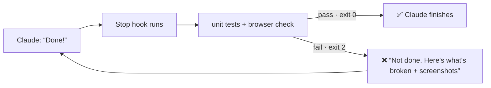

# Prove It's Done

**Make Claude Code prove its work in a real browser before it's allowed to say "done".**

▶️ **Watch the video:** [Your AI Agent Is Lying When It Says "Done"](https://youtu.be/wRdAVLnn58w)

---

## The problem

Your AI agent says *"All tests pass. The feature is complete."* You open the app and every number says **₹NaN**.

The agent wasn't lying on purpose. Unit tests check the **code**, usually against clean, made-up test data. Nobody checked the **screen**, where the real (messy) data shows up.

Writing *"please verify your work"* in `CLAUDE.md` doesn't fix it. That's a suggestion, and agents skip suggestions when they want to finish.

## The fix: a gate, not a suggestion

This kit adds a Claude Code **Stop hook**. Every time Claude tries to finish, the hook runs your unit tests **plus** a real-browser check. If anything fails, Claude is **blocked from stopping** and gets the failure report and screenshots, so it has to fix the problem first.



After 3 failed attempts it lets Claude stop anyway, so a human can take a look. It will never loop forever.

## What's in the kit (3 files)

| File | What it does |
|---|---|
| [`kit/verify/verify.mjs`](kit/verify/verify.mjs) | Opens your app in headless Chrome at **desktop and mobile** sizes and fails on: JavaScript errors, failed requests (404/500), broken values on screen (`NaN`, `undefined`, `null`, `[object Object]`, `Infinity`), and layout overflowing a phone screen. It saves screenshots so the agent has to **look**. |
| [`kit/.claude/hooks/verify-before-done.sh`](kit/.claude/hooks/verify-before-done.sh) | The Stop hook. It runs `npm test` and `npm run verify`. On failure it exits with code **2**, which tells Claude Code "you're not done" and feeds the report back to Claude. Includes the 3-try safety valve. |
| [`kit/.claude/settings.json`](kit/.claude/settings.json) | The ~10 lines that register the hook with Claude Code. |

## Quick start (add it to your project)

Requirements: [Claude Code](https://claude.com/claude-code), Node 18+, bash (macOS/Linux; on Windows use WSL), and a project with a `package.json`.

```bash
git clone https://github.com/anant1811/claude-code-prove-its-done.git
cd claude-code-prove-its-done

# Point it at your app: the URL to check, and (optionally) how to start it
VERIFY_URL=http://localhost:5173 VERIFY_START="npm run dev" ./install-kit.sh ~/code/my-app
```

The installer:
- copies the 3 files into your project
- adds an `npm run verify` script
- installs Playwright + Chromium
- adds the screenshot folder to `.gitignore`

Then:
1. **Restart Claude Code** in your project (hooks load when a session starts). `claude --continue` keeps your conversation.
2. Type `/hooks` and confirm there's a **Stop** hook listed.
3. Run `npm run verify` once yourself to make sure it passes on your current app.

That's it. The next time Claude says "done", the gate runs first.

> **Already have `.claude/settings.json`?** The installer won't overwrite it. Copy the `"hooks"` block from [`kit/.claude/settings.json`](kit/.claude/settings.json) into your file by hand.

### Manual install

1. Copy `kit/verify/verify.mjs` to `verify/verify.mjs` in your project.
2. Copy `kit/.claude/hooks/verify-before-done.sh` to `.claude/hooks/` and run `chmod +x` on it.
3. Add the `hooks` block from `kit/.claude/settings.json` to your `.claude/settings.json`.
4. Add a script to `package.json`:
   ```json
   "verify": "VERIFY_URL=http://localhost:3000 VERIFY_START='npm run dev' node verify/verify.mjs"
   ```
5. Run `npm i -D playwright && npx playwright install chromium`.

## Try the demo from the video

`example/` is the "Flat Splitter" app from the video: a small expense splitter with 150 **messy** expenses. Older ones came from a bank export with text amounts like `"2,835.50"`, and there's a flatmate who moved out. The unit tests only use clean numbers. That's the trap.

```bash
cd example
npm start                      # app at http://localhost:4173 (leave running)

# In another terminal, in example/, WITHOUT the kit:
claude --model haiku
```

Give it this task:

```
Add a 'Settle up' panel at the top that shows each person's balance: how much they owe or are owed. Put the math in logic.js and add tests. Make sure the tests pass.
```

Refresh the browser. In our testing, the fast Haiku model said "all tests pass" with **₹NaN** on screen about half the time. Opus usually got it right on this small app. If Haiku gets it right, run `git stash -u` and try again.

Now add the gate and ask it to finish again:

```bash
/exit
../install-kit.sh .                        # from example/
claude --continue --model haiku
```

```
Run the tests once more and then finish.
```

Watch the Stop hook block "done". Claude opens the screenshots, finds the text amounts, fixes them and re-runs verify.

## Customizing

- **Different URL or start command:** edit the `verify` script in `package.json` (`VERIFY_URL`, `VERIFY_START`). If the app is already running at `VERIFY_URL`, verify uses it and doesn't start anything.
- **Check more pages:** turn `url` in `verify.mjs` into a list and loop over it. Checking your key routes (e.g. `/`, `/checkout`, `/settings`) is well worth it.
- **Add your own checks:** anything you can express with [Playwright](https://playwright.dev) goes in the viewport loop. For example: "the page has an `<h1>`", "the total on screen matches the API", "no element says 'Lorem ipsum'".
- **Not using npm?** Edit the one line in `verify-before-done.sh` that runs `npm test && npm run verify`. For example, use `pytest && node verify/verify.mjs`.
- **More or fewer retries:** change the `3` in the safety valve.

## Troubleshooting

| Symptom | Fix |
|---|---|
| Claude finishes and the hook never ran | Hooks load at session start. Restart Claude Code, then check `/hooks` for a Stop hook. |
| `nothing is running at http://localhost:…` | Start your app, or set `VERIFY_START` so verify starts it for you. |
| Port already in use / checks the wrong app | Another process is on that port. Stop it or change the port in `VERIFY_URL` (and `PORT` for the example). |
| It runs even when Claude just answered a question | By design. It checks on every stop (about 5–10s) because agents often commit their changes, and a "did the code change?" check misses those. |
| Claude keeps failing | After 3 tries it stops and tells you. Read the screenshots in `verify/screenshots/` yourself. |
| `Executable doesn't exist` (Playwright) | Run `npx playwright install chromium`. |

## One honest caveat

A gate proves the checks passed, not that the fix is **right**. In the video, the agent fixed the NaN bug and quietly "fixed" the data too: it replaced the flatmate who moved out with someone else, which changed who owes what. The hook caught the broken screen. A human still has to read the diff. Use this to stop fake "done"s, not to stop reviewing.

## License

MIT. Use it, change it, ship it.

---

Made by **Ash** · [YouTube @ashishanant_ai](https://www.youtube.com/@ashishanant_ai). I build real things with AI and tell you what survives contact with reality.
